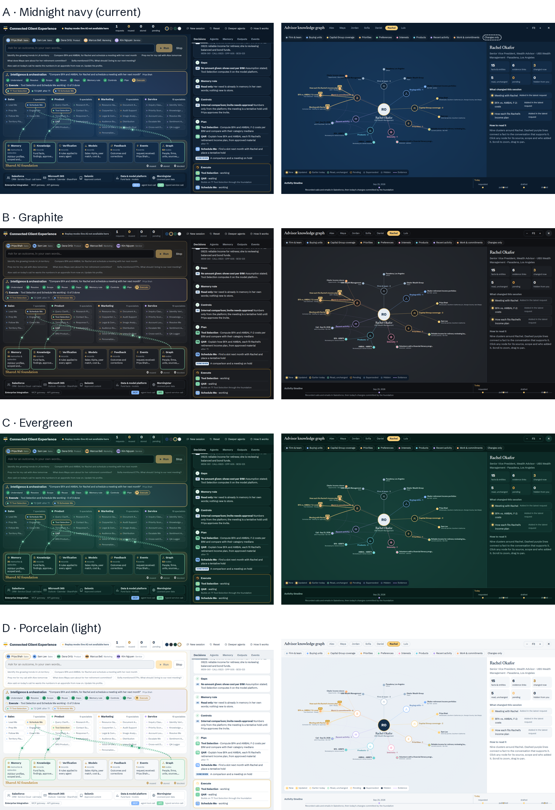

# live_ccc: Connected Client Experience (live demo)

A live, interactive demonstration of how a **shared AI foundation** lets specialist AI agents across **Sales, Marketing, Product and Service** work as one team around the same advisor relationship.

You type a request as a real role (a wholesaler, a product specialist, a marketer, a service rep). An AI **orchestration layer** decides how to handle it in nine visible steps, the right **specialist agents** do the work and call enterprise systems, and a **shared foundation** decides exactly what each agent may see, checks everything they contribute, and remembers what was learned.



---

## Background

### The problem
Sales, Marketing, Product and Service all serve the same advisor, but each function’s tools and assistants work separately. Sales has the latest meeting context, Product has the current evidence, Marketing has its own version of the material, and Service doesn’t know what was sent. The advisor experiences that as repeated questions, inconsistent answers and missed commitments.

Adding more AI assistants doesn’t fix it. **The agents need shared context, shared evidence, shared controls and a coordinated way of carrying work forward.**

### The idea
> The agents stay specialists. The intelligence, knowledge, context and controls underneath them are shared.

The foundation has seven components:

| Component | Question it answers |
|---|---|
| **Shared Memory** | Who is this advisor, and what have they already told us? |
| **Knowledge & Retrieval** | What approved evidence supports the answer? |
| **Verification & Compliance** | Is the claim supported, and is the action allowed? |
| **Analytics & Models** | What should we prioritize, compare or construct? |
| **Feedback Data** | What happened, and what should improve? |
| **Event-Driven Signals** | What changed, and who needs to act? |
| **Graph Knowledge Layer** | How are people, firms, meetings, funds and documents connected? |

Around it sit **37 named specialists** (Sales 7, Product 9, Marketing 11, Service 10), an **Intelligence & Orchestration** layer that plans and routes work, and **governed integration** with Salesforce (CRM, Service Cloud cases, plan records), Microsoft 365, Seismic (content, approved messaging, LiveSend delivery logs), the fund data platform, Morningstar, Genesys Cloud (contact center and service insights), Salesforce Marketing Cloud and Adobe Experience Manager, through an MCP gateway for agent tool calls and APIs for typed data.

### What the demo proves
- **Nobody repeats themselves.** One specialist’s verified work becomes the next one’s starting point, visibly, through the foundation.
- **The right context, not all context.** Each agent receives a purpose-scoped packet; out-of-scope, personal and private records are withheld, with the reason shown.
- **Memory with rules.** An employee’s request is not an advisor preference. Lasting preferences need the advisor’s own recorded words; otherwise they stay *pending validation*. Preferences apply only to the buying unit they were stated for. Revisions keep history.
- **Numbers come from systems of record, never from the model.** Every figure must trace to a tool result or stored record, or it is flagged or blocked.
- **People approve what goes out.** Anything client-facing waits for human approval.
- **The advisor becomes richer over time.** The knowledge graph shows each advisor’s firm, units, coverage, priorities, preferences, interests, products, recent activity and work, and highlights what each request added, updated, read or left pending.

---

## Sales AI: intelligence and orchestration

This branch puts the intelligence and orchestration layer at the center. Every request is first **interpreted** (subject, business intent, scope, time, constraints, requested output, missing information, action authority), then **orchestrated** as sub-agent routes in waves: independent reads run together, checks wait for what they check, and the requested output comes last. Each step returns its output, sources, as-of dates, unresolved issues and status.

- **Business intents, not keywords:** retrieve, summarize, compare, diagnose, prioritize, prepare, verify, draft, execute, remember, monitor.
- **Action authority by rule:** “help me prepare” is read-only, so it never books, sends or updates anything; tools above the authority are removed at the gateway and follow-ups are proposed, not created.
- **Catalogue tab:** 58 catalogued requests with their decomposition and route (`Prep.Notes` = Prep Me → Notes Summarizer). **Decompose** turns a route into a plan without an AI call; **Plan only** in the command bar shows the live AI’s own decomposition without running it.
- **Shared services** in `[brackets]` are marked simulated, built into the foundation, or not connected; a step that needs a missing one says what it could not establish.
- Try (as Priya): `Why are Daniel’s overall sales down when his ETF sales are up?`, `Which CG ETFs are available at Wells Fargo for Daniel?`, `Prepare me for tomorrow’s meeting with Daniel’s team`. Each has a saved run (▶).

Details: [docs/sales-ai-query-catalogue.md](docs/sales-ai-query-catalogue.md).

---

## What you’ll see

- **Command bar:** pick who you are, type an outcome, press Enter.
- **Orchestration in nine steps:** Understand, Resolve, Scope, Reuse, Gaps, Memory rule, Controls, Plan, Execute. Each step shows whether it was decided by **AI** or by a **RULE**.
- **Live architecture:** curved flows show requests, dispatches, reads from and writes to the foundation, system calls (MCP or API) and handoffs between specialists.
- **Right panel tabs:** Updates · Decisions · Agents (exact context packet in, tool calls, contribution out, gatekeeper verdicts) · Memory (per advisor) · Events.
- **Traceability on every step:** each step in Updates shows *Where this came from*: what the foundation sent (and withheld), the steps it built on, and each system it queried, why, and what came back. The step that is running shows its calls as they happen.
- **Edit before approval:** drafts waiting for approval can be edited; the edit is re-checked against the same rules (personal notes, numbers traced to a system of record) before it is saved as a new revision.
- **What to do next:** every run ends with a card for the requester: the agents’ suggested next step, drafts to approve, follow-ups created, preferences to confirm with the advisor and open questions.
- **Advisor knowledge graph:** click *Expand* in the Memory tab or the Graph tile.
- **Themes:** four color dots in the top bar (Midnight navy, Graphite, Evergreen, Porcelain light), or `?theme=graphite` in the URL.

**Good first requests** (as Priya Shah, Sales):
1. `Identify the growing trends in LA territory`
2. `Compare BFA and AMBAL for Rachel and schedule a meeting with her next month`
3. `Prepare Maya’s retirement committee fee comparison review`
4. `Alex said on today’s call he wants the numbers in an appendix from now on. Update his profile.` Watch it land as *pending*, not memory, then open Alex’s knowledge graph.

**One request per role** (pick the person first):
- Sam Lee, Sales: `Prep me for my call with Alex tomorrow`. Sam is taking over Alex from Priya (handover HO-101), so the brief reuses Priya’s calls and Product’s work, but Sam owns it.
- Dana Ortiz, Product: `Why has GFA trailed the Vanguard growth index? I need an explanation advisors can use.`
- Marcus Bell, Marketing: `Write a LinkedIn post on fee transparency for advisors`. Compliance flags the missing disclosures; add them with **Edit** and approve.
- Kim Nguyen, Service: `Alex says the link in Priya’s email won’t open`. The diagnosis cites the Genesys call, the open case and the Seismic delivery log.

**Saved runs:** a ▶ next to a suggestion plays a saved run of it through the same foundation, tools and gatekeeper, with no AI call. Use them when there is no AI key or for a repeatable demo. The five above and four of Priya’s are included; the five were authored to the demo script rather than captured live. After a good live run, **Save as replay** on the closing card keeps it for the session and downloads it for `src/replay.js`.

---

## Run it

Requirements: **Node.js 18 or later.** No `npm install` needed; there are no dependencies.

### Option 1: with OpenAI (live AI)
```bash
git clone https://github.com/<you>/live_ccc.git
cd live_ccc
cp .env.example .env        # edit: OPENAI_API_KEY, DEMO_USER, DEMO_PASSWORD
npm start
```
Open **http://localhost:8080** and sign in. The top bar should read **Live AI · OpenAI · gpt-4o with tools**.

### Option 2: with Azure OpenAI
In `.env`, set `AZURE_OPENAI_ENDPOINT`, `AZURE_OPENAI_API_KEY`, `AZURE_OPENAI_DEPLOYMENT_ORCHESTRATOR`, `AZURE_OPENAI_DEPLOYMENT_AGENT` (and optionally `AZURE_OPENAI_API_VERSION`). These take priority over the OpenAI settings. Then `npm start`.

### Option 3: offline, no key (for trying the flow)
```bash
npm run mock        # terminal 1: a stand-in OpenAI API on port 9999
npm run dev:mock    # terminal 2: the app, pointed at the stand-in
```
The stand-in always returns one fixed plan, so use the prompt *Compare BFA and AMBAL for Rachel and schedule a meeting with her next month*. On Windows, set `OPENAI_API_KEY=mock` and `OPENAI_BASE_URL=http://localhost:9999/v1` in `.env` and run `npm start` instead of `dev:mock`.

---

## Configuration

| Variable | Required | Default | Notes |
|---|---|---|---|
| `OPENAI_API_KEY` | yes (OpenAI) | | Stays on the server; never sent to the browser |
| `OPENAI_MODEL_ORCHESTRATOR` | no | `gpt-4o` | Plans and streams decisions; use your strongest approved model |
| `OPENAI_MODEL_AGENT` | no | `gpt-4o-mini` | Each specialist; must support function calling |
| `OPENAI_BASE_URL` | no | OpenAI | For a proxy or OpenAI-compatible gateway |
| `AZURE_OPENAI_*` | yes (Azure) | | See Option 2 |
| `DEMO_USER`, `DEMO_PASSWORD` | recommended | | Sign-in for the whole site |
| `PORT` | no | `8080` | |
| `TEMPERATURE` | no | `0.2` | Set empty for models that reject temperature |
| `MAX_TOKENS_PARAM` | no | `max_completion_tokens` | Use `max_tokens` for older Azure API versions |
| `MAX_TOKENS_ORCHESTRATOR` / `MAX_TOKENS_AGENT` | no | `2500` / `1800` | |
| `RATE_LIMIT_PER_MINUTE` | no | `120` | Per IP, on `/api/chat` |

---

## Deploy

> **Protect it first.** Set `DEMO_USER` / `DEMO_PASSWORD`, or put it behind company SSO or a private network. Otherwise anyone with the URL can use your AI quota.

**Docker (any cloud)**
```bash
docker build -t live-ccc .
docker run -p 8080:8080 --env-file .env live-ccc
```

**Azure App Service (Linux, Node 20)**
```bash
az webapp up --name <app-name> --runtime "NODE:20-lts" --sku B1
az webapp config appsettings set --name <app-name> --resource-group <rg> --settings \
  OPENAI_API_KEY=<key> OPENAI_MODEL_ORCHESTRATOR=gpt-4o OPENAI_MODEL_AGENT=gpt-4o-mini \
  DEMO_USER=demo DEMO_PASSWORD=<strong-password>
```
App Service runs `npm start` and supplies `PORT`. Set the health check path to `/healthz`. Keep the key in Azure Key Vault and reference it from the app setting.

**Azure Container Apps, Cloud Run, AWS App Runner, Render, Railway:** deploy the Docker image or the folder (start command `npm start`), set the variables as secrets, expose port 8080, health check `/healthz`.

---

## How it works

```
Browser: public/index.html                    server.js                 OpenAI / Azure OpenAI
 ├ Orchestration (streams its decisions) ────▶ POST /api/chat ────────▶ orchestrator model
 ├ Each specialist (function calling) ───────▶ POST /api/chat ────────▶ agent model
 │   tool call ◀──────────────────────────────────────────────────────────┘
 │   the page runs the tool (Salesforce, M365, Seismic, fund data are simulated in the page)
 │   and returns the result ─────────────────▶ POST /api/chat ────────▶ agent model
 └ Shared foundation rules run in the page as plain code: context packets, scope,
   evidence and number checks, memory rules, approvals, events, knowledge graph.
```
- `GET /api/config` tells the page which provider and models are configured (never the key).
- `POST /api/chat` is the only route to the model; the server pins the model, caps tokens and rate-limits.
- If a plan comes back unusable, the app asks once more in strict JSON, then falls back to a rules-based plan. Each specialist retries once. Clarifying questions are asked at most once.

---

## Repository layout

```
live_ccc/
├─ public/
│  ├─ index.html          the live app (built from src/, committed so deploys need no build step)
│  └─ guided-tour.html    the earlier scripted walkthrough (no AI needed)
├─ src/                   app source
│  ├─ index.tpl.html      page shell
│  ├─ data.js             reference data: advisors, memory, episodes, funds, content, policies, 37-agent registry
│  ├─ catalogue.js        Sales AI: intents, sub-agent routes, shared services, the query catalogue
│  ├─ engine.js           foundation: tools, context packets, gatekeeper, AI connectors (Claude and OpenAI)
│  ├─ graph.js            advisor knowledge graph
│  ├─ ui.js               orchestration runtime and rendering
│  ├─ replay.js           saved runs, played with ▶ next to a suggestion
│  └─ base.css, extra.css styles and themes
├─ scripts/
│  ├─ build.mjs           npm run build: src/ → public/index.html
│  └─ mock-openai.mjs     npm run mock: offline stand-in API
├─ server.js              zero-dependency Node server (static files + AI proxy)
├─ Dockerfile, .env.example, package.json
└─ docs/theme-options.png
```

**Changing the app:** edit files in `src/`, then run `npm run build` and commit both `src/` and `public/index.html`.

**Connecting real systems later:** each simulated enterprise tool is a function in `TOOLS` (in `src/engine.js`) with a name, system, MCP-or-API label and schema. Replace its `run` with a call to your MCP gateway or API, and keep the rest.

---

## Data notice
- People, firms’ teams, conversations, holdings, the retirement plan (PLAN-102), service contacts, delivery logs, campaign results and approved messaging in the reference data are **fictional**. Firm names are real only for context.
- Fund expense ratios for GFA (F-2 0.40%), BFA (F-2 0.34%), AMBAL (F-2 0.35%), VWUAX (0.25%) and VIGAX (0.05%) come from public sources as of the dates shown in the app; other funds’ numbers are intentionally left out, and performance is never generated.
- Get compliance and security approval before connecting real client data or sending it to any AI provider.
